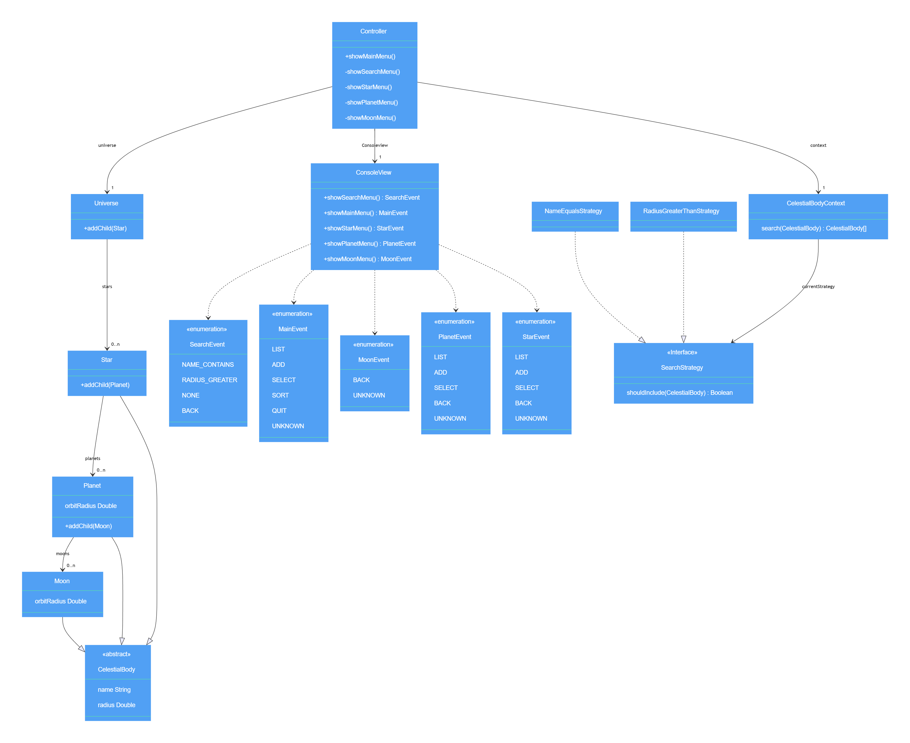

# Universe

Project for the course "Object Oriented Analysis and Design" at Linnaeus University.

## Table of Contents

- [Universe](#universe)
  - [Table of Contents](#table-of-contents)
  - [Introduction](#introduction)
  - [Features](#features)
  - [Design Patterns](#design-patterns)
  - [Project Structure](#project-structure)
  - [Installation and Setup](#installation-and-setup)
    - [Prerequisites](#prerequisites)
    - [Build the Project](#build-the-project)
  - [Usage Instructions](#usage-instructions)
    - [Navigating the Application](#navigating-the-application)

## Introduction

The **Universe** project is a console-based application that simulates a universe with celestial bodies such as stars, planets, and moons. Developed in Java, it adheres to the Model-View-Controller (MVC) architectural pattern and utilizes Gradle as its build tool. The application allows users to interact with and explore a simulated universe through a command-line interface.

## Features

- **Celestial Body Management**: Add, view, and manage stars, planets, and moons.
- **Search Functionality**: Search for celestial bodies based on different criteria using strategy patterns.
- **Observer Pattern Implementation**: Monitor changes in celestial bodies.
- **Console-Based UI**: Navigate through the application using a user-friendly command-line interface.

## Design Patterns

The project implements several design patterns to ensure a modular and scalable architecture:

- **Model-View-Controller (MVC)**: Separates the application into three interconnected components, allowing for efficient code management and scalability.
- **Observer Pattern**: Enables objects (observers) to receive updates when the state of another object (subject) changes.
- **Strategy Pattern**: Allows the selection of algorithms at runtime, providing flexibility in search functionalities.

## Project Structure



```
Universe
├── Controller
│   ├── Controller.java
│   └── Search
│       └── CelestialBodyContext.java
├── Model
│   ├── Observer
│   │   ├── CelestialObserver.java
│   │   └── CelestialSubject.java
│   ├── Search
│   │   ├── NameEqualStrategy.java
│   │   ├── RadiusGreaterThanStrategy.java
│   │   └── SearchStrategy.java
│   ├── CelestialBody.java
│   ├── CelestialBodyManager.java
│   ├── CelestialRules.java
│   ├── Moon.java
│   ├── Orbital.java
│   ├── Planet.java
│   ├── Star.java
│   └── Universe.java
└── View
    ├── Events
    │   ├── MainEvent.java
    │   ├── MoonEvent.java
    │   ├── PlanetEvent.java
    │   ├── SearchEvent.java
    │   └── StarEvent.java
    ├── ConsoleView.java
    └── View.java
```

## Installation and Setup

### Prerequisites

- **Java Development Kit (JDK) 8 or higher**: Ensure that Java is installed on your system.
- **Gradle**: The project uses Gradle Wrapper, so you don't need to install Gradle separately.

### Build the Project

Clone the repository:

```bash
git clone https://github.com/samuelmevik/universe.git
cd universe
```

Build the project using Gradle:

```bash
./gradlew build
```

> **Note**: On Windows, use `gradlew.bat` instead of `./gradlew`.

## Usage Instructions

Run the application using Gradle:

```bash
./gradlew run -q --console=plain
```

Alternatively, you can run the main method in `App.java` from your IDE.

### Navigating the Application

- **Starting the Application**: Run the main method of `App.java` or use the Gradle run command.
- **Menu Navigation**: Enter numbers corresponding to the menu options to navigate through the application.
- **User Prompts**: The application will prompt you when input is required.


